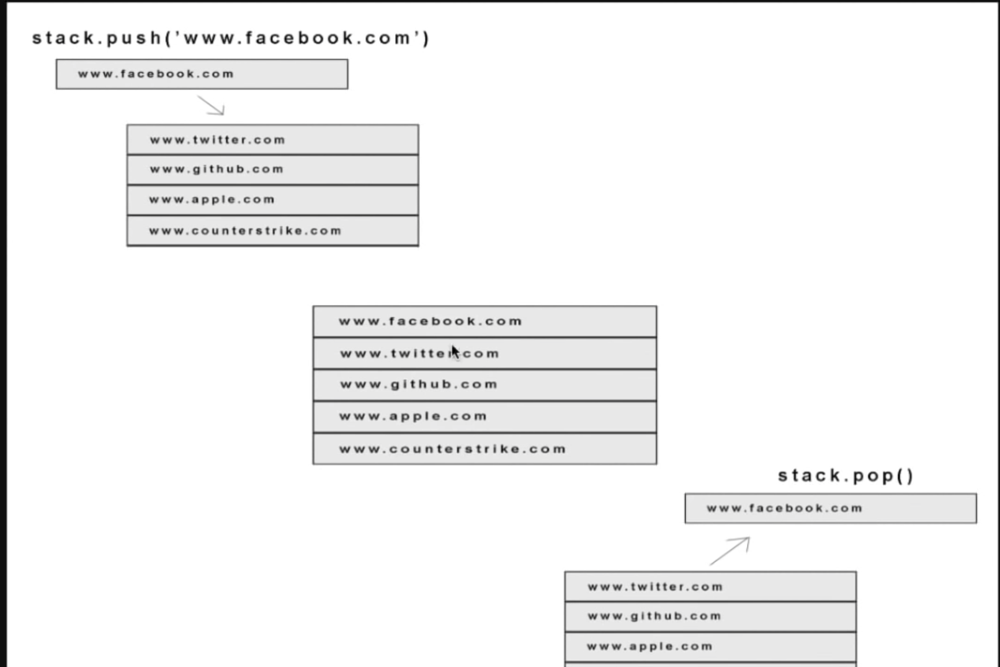

stacks: a pile of objects, typically one that is neatly arranged.

<!-- function -->

## Function

- push: for placing data onto a stack
- pop: remove the top data from a stack
- peek: displaying the top element of a stack
- length: size how many elements in a stack

**Palindrome**

is a word that is spelled the same forwards and backwards such as Bob - b.o.b / racecar;
